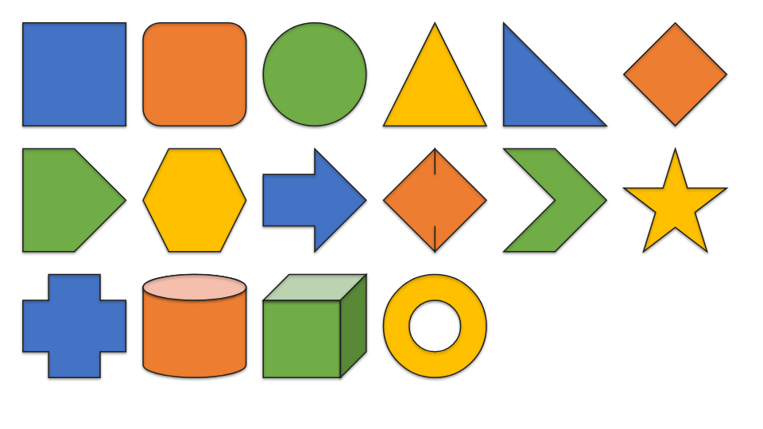
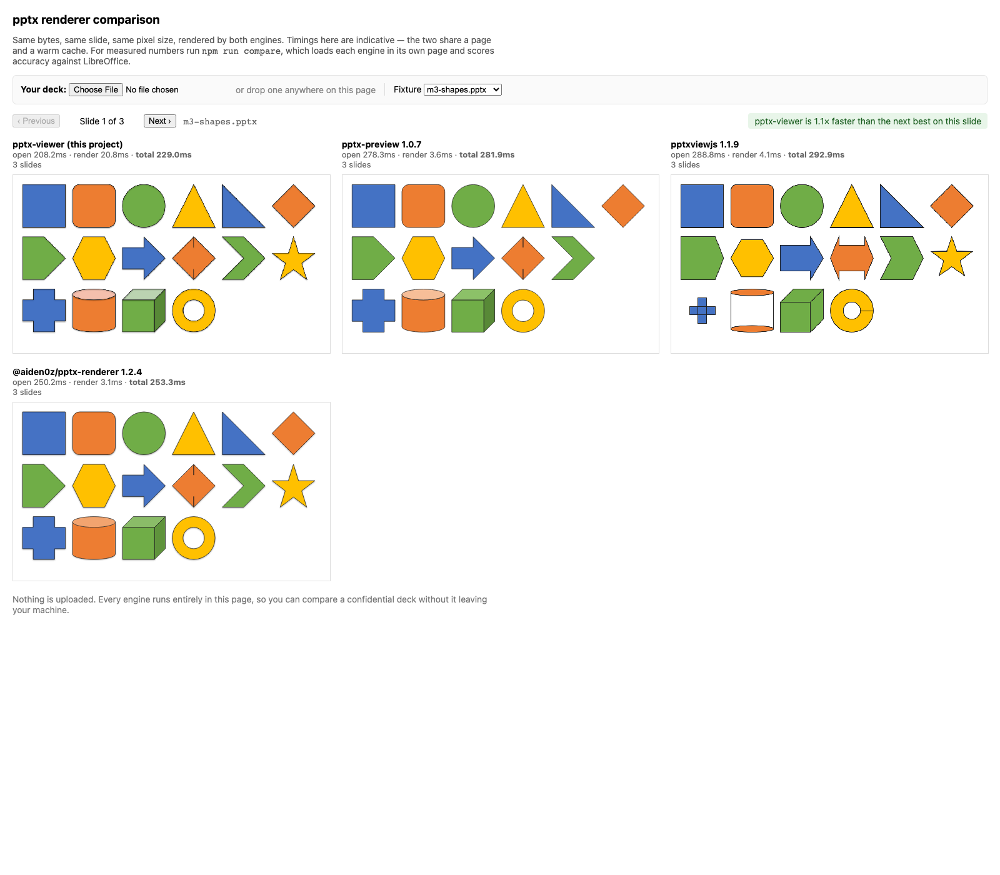

# pptx-wasm

[](https://www.npmjs.com/package/pptx-wasm)
[](#how-it-compares)
[](LICENSE)

A browser-native, read-only `.pptx` renderer. Rust compiled to WebAssembly does the
parsing, layout and drawing; TypeScript wraps it; React is optional. **Nothing is
uploaded** — the file is parsed and drawn on the client, so a confidential deck never
leaves the machine.

The most accurate of the browser pptx renderers on shapes, tables and effects — and the
fastest of the accurate ones, on both first load and subsequent slides.
[See the numbers.](#how-it-compares)

```sh
npm install pptx-wasm
```

```tsx
import { PresentationViewer } from 'pptx-wasm/react';

<PresentationViewer src="/deck.pptx" width="100%" height="100vh" />
```



*`m3-shapes.pptx` as this renderer draws it — preset geometry from the ECMA-376 formulas,
including the lit and shaded faces of `can` and `cube`.*

**Using the package?** [`packages/viewer/README.md`](packages/viewer/README.md) is the API
reference. This file is about working on the project; [`ROADMAP.md`](ROADMAP.md) is where
it goes next.

## How it fits together

```
.pptx bytes
   ↓  crates/core::opc        ZIP container, [Content_Types].xml, the .rels graph
   ↓  crates/core::parse      OOXML → presentation model (still in EMUs, still unresolved)
   ↓  crates/core::layout     inheritance, text measurement, geometry → display list (points)
   ↓  crates/renderer         Renderer trait → canvas2d | record | webgpu
   ↓  crates/wasm             wasm-bindgen surface
   ↓  packages/viewer         async work: fetching, image decoding, font loading, React
canvas
```

Two conventions carry a lot of weight, and both are explained in
[`CLAUDE.md`](CLAUDE.md):

- **The display list is in points, not pixels.** Zoom, resize and DPR changes re-render
  without re-laying-out, which is why wrap points cannot drift between zoom levels.
- **`None` means "not specified", not "default".** The whole inheritance chain depends on
  telling an unset property from one explicitly set to a default value.

`CLAUDE.md` also records the decisions that shaped the design — the text backend, the
renderer abstraction, and why there is no Web Worker — each with the measurements behind
it. [`ROADMAP.md`](ROADMAP.md) is where this goes next, and why.

## How it compares

Seven browser-side pptx renderers, same 11 fixtures, same machine. Payload is gzipped and
measured by bundling each engine; `cold` is a first render in a fresh page including module
and WASM instantiation; `warm` is opening another deck in the same page.

| engine | payload | cold | warm | structure | text |
|---|---:|---:|---:|---:|---:|
| **pptx-wasm** (this project) | 319 KB | **31.0 ms** | **2.0 ms** | **1.15%** | 27.43% |
| [@aiden0z/pptx-renderer](https://www.npmjs.com/package/@aiden0z/pptx-renderer) 1.2.4 | 349 KB | 98.9 ms | 6.0 ms | 1.37% | 26.93% |
| [pptxviewjs](https://www.npmjs.com/package/pptxviewjs) 1.1.9 | 252 KB | 103.5 ms | 39.6 ms | 12.37% | 26.72% |
| [pptx-glimpse](https://www.npmjs.com/package/pptx-glimpse) 5.0.0 | 167 KB | 38.1 ms | 9.6 ms | 15.12% | 27.08% |
| [pptx-preview](https://www.npmjs.com/package/pptx-preview) 1.0.7 | 426 KB | 95.9 ms | 5.7 ms | 21.54% | 24.44% |
| [@jvmr/pptx-to-html](https://www.npmjs.com/package/@jvmr/pptx-to-html) 1.1.1 | 45 KB | 20.9 ms | 3.0 ms | 46.58% | 69.15% |
| [pptx-vanilla-viewer](https://www.npmjs.com/package/pptx-vanilla-viewer) 1.6.2 | 1695 KB | 225.9 ms | 28.5 ms | 58.61% | 64.72% |

Both fidelity columns are the share of inked pixels differing from a LibreOffice render of
the same slide, so lower is closer. They are reported separately because they measure
different things — pooling them buries the informative half:

- **structure** — shapes, tables, effects, fills. This is the column that discriminates:
  it spreads from 1% to 59%.
- **text** — paragraphs and titles. Every competent engine lands within three points of
  the others, because there the diff is dominated by font rasterisation, which a browser
  and LibreOffice will never agree on. **Read it as a floor, not as a score.**

Fixtures the oracle cannot adjudicate are excluded outright rather than scored:
`m5b` because chart.xml carries no geometry, so each renderer invents its own axes, and
`m5f` because LibreOffice ignores `<a:tile>` and stretches the image — scoring it would
reward engines for repeating the oracle's bug. `suites.json` records both reasons.

**On structure this is the most accurate engine measured**, at 1.15% against 1.37% for the
next best and 12–59% for the rest. It is also the fastest of the five engines that render
a deck accurately, on both cold and warm — the one engine that starts faster renders at
46.58%.

`npm run compare` reproduces all of it; `-- --file=deck.pptx` scores your own deck. The
same app runs interactively, so differences are visible rather than argued about:



*The same deck in four engines. pptx-preview drops the five-pointed star entirely;
pptxviewjs mis-draws the hexagon and the plus.*

### Reading it honestly

- **Payload is fourth of seven.** 319 KB is mid-pack; the WASM core buys the speed and the
  coverage, and costs bytes. Reducing it is the top item in [`ROADMAP.md`](ROADMAP.md).
- **The structural lead over @aiden0z/pptx-renderer is 1.15% against 1.37%** — real, but
  narrow. That engine is the genuine competition; the rest of the field is not close on
  this axis.
- **On text this is the *weakest* of the accurate engines**, at 27.43% against
  pptx-preview's 24.44%. The band is only three points wide and is mostly rasterisation
  noise, but the ordering is not flattering and is not being hidden. There is an open
  question behind it: on the inheritance fixture our text renders about 8% larger in ink
  extent than LibreOffice's, while our resolved sizes match the slide master exactly.
  That looks like font substitution rather than a bug, but it has not been confirmed
  against PowerPoint itself.
- **LibreOffice is not ground truth.** It is an independent implementation, not
  PowerPoint. Where the two disagree the number reflects the disagreement, not who is
  right. See [Testing](#testing).

Two of these packages do not install cleanly: `pptxviewjs` imports `chart.js/auto` and
`pptx-vanilla-viewer` imports `three`, neither declared as a dependency. Both are
installed explicitly in `examples/comparison` and counted in their payload.

## Getting set up

```sh
# Rust, for the core
curl --proto '=https' --tlsv1.2 -sSf https://sh.rustup.rs | sh
rustup target add wasm32-unknown-unknown
brew install wasm-pack binaryen        # or your platform's equivalent

# Node
npm install

# Fixture generation and the golden-test oracle
python3 -m venv .venv && ./.venv/bin/pip install python-pptx Pillow
brew install --cask libreoffice
brew install poppler
npx playwright install chromium firefox webkit
```

`npm run test:golden` reports which of these are missing and degrades rather than failing
outright, so you can work on the Rust without the whole toolchain installed.

## Commands

| | |
|---|---|
| `npm run dev` | build the WASM and serve the dev app on :5178 |
| `npm run wasm` | build the WASM only |
| `npm run build:pkg` | build the WASM **and** the package — what the examples consume |
| `npm run build` | build the publishable package |
| `cargo test --workspace` | Rust tests — parsing, layout, culling, renderer behaviour |
| `npm run test:golden` | render every fixture and pixel-diff against LibreOffice |
| `npm run test:golden -- --suite=m2` | one suite |
| `npm run test:browsers` | render every fixture in Chromium, Firefox and WebKit |
| `npm run bench` | performance numbers for this renderer alone |
| `npm run compare` | benchmark against the six other npm pptx renderers |
| `npm run fixtures` | regenerate the `.pptx` fixtures |
| `npm test` | all three test layers in sequence |

The browser-driven commands start a dev server if one is not already up, and leave a
server you started yourself alone.

## Testing

Three layers, each answering a different question.

**`cargo test`** asks *is the logic right?* Layout runs against a synthetic measurer
(`StubMeasure`), so it asserts where line breaks fall without depending on which fonts the
machine has. The recording renderer lets renderer behaviour — clip nesting, transform
composition, what gets culled — be asserted with no browser involved.

**`npm run test:golden`** asks *do the pixels match?* Fixtures are generated with
python-pptx, rendered by headless LibreOffice via PDF, rendered by the viewer in headless
Chromium, and diffed. Per-suite tolerances live in
[`tests/golden/suites.json`](tests/golden/suites.json), each with a written reason.

The oracle is LibreOffice, not PowerPoint. It is *consistent*, which is what a regression
detector needs, but some diffs are its fault. Two things follow from that: a tolerance is
a decision to record rather than a knob to turn, and pixel tolerance is a poor detector of
"did this feature stop working" — a shadow vanishing entirely moves the figure by half a
percent. Unit tests are the guard for that.

Sometimes the oracle is not merely imprecise but *wrong*: it ignores `<a:tile>` on a blip
fill and stretches the image instead. Diffing against it there would score a correct render
worse than a broken one. Such a suite sets `"oracle": false` and compares against a
reviewed reference committed in [`tests/golden/reference/`](tests/golden/reference/); the
runner labels those lines so the weaker guarantee is visible where the number is read. So
before trusting a new tolerance, check the oracle renders the feature at all.

**`npm run test:browsers`** asks *does it work everywhere?* Every fixture is rendered in
all three engines and the extracted text compared. This is where the text-backend decision
gets checked against reality rather than argued about.

### When a golden diff appears

Get `debugTrace()` for the slide first — the runner writes one per slide to
`tests/golden/out/trace/`. It tells you in one look whether layout moved something or the
rasteriser drew it differently, which is the most common ambiguity in this project.

## Repository layout

| | |
|---|---|
| `crates/core` | OPC container, OOXML parsers, presentation model, layout, display list |
| `crates/renderer` | the `Renderer` trait, `canvas2d`, `record`, `webgpu` (a measured stub), culling |
| `crates/wasm` | the wasm-bindgen surface — deliberately narrow |
| `packages/viewer` | the TypeScript API and the React component |
| `examples/basic` | a small app using only the documented API |
| `examples/comparison` | every engine side by side on the same deck, including your own |
| `fixtures/` | `gen.py`, which builds every fixture the golden suite uses |
| `tests/golden/` | the oracle, the runner, the bench, the cross-browser check |

## Licence

MIT
