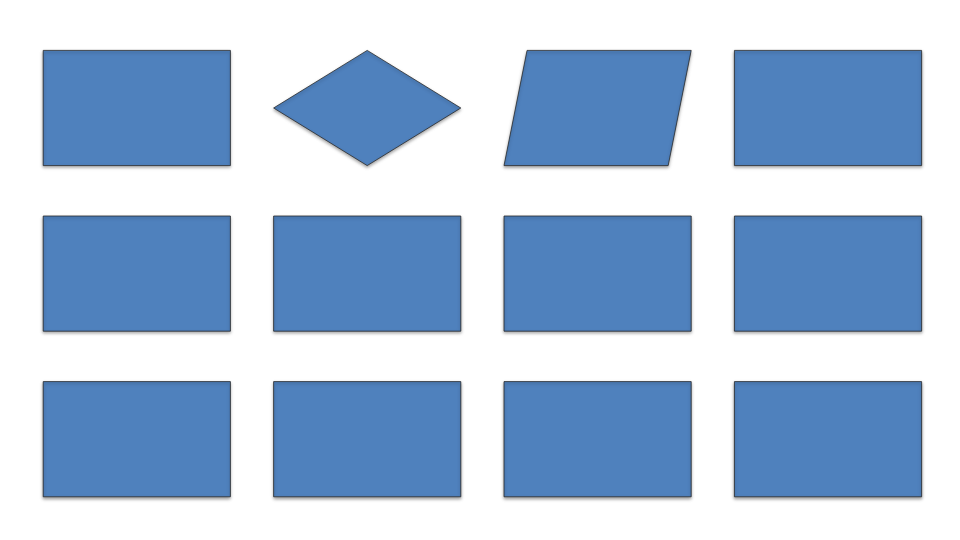
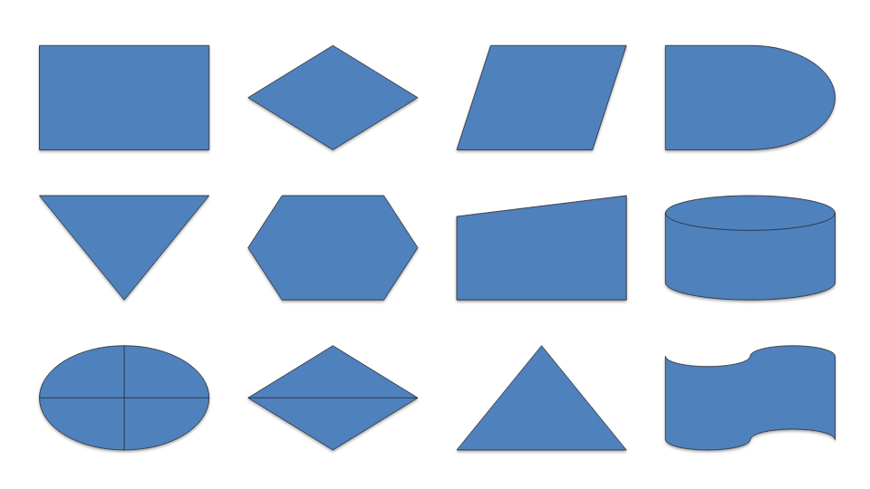

# Roadmap

Where this renderer stands against the field, what would actually move it, and in what
order. Every claim here is a measurement from `npm run compare` or `npm run bench`, not an
estimate — where something is an estimate it says so.

## Where we actually stand

Of seven browser pptx renderers, on the 14 fixtures all of them render (0.2.0):

| axis | rank | note |
|---|---|---|
| fidelity (structure) | **1 of 7** | 1.23% against @aiden0z's 1.54%; the rest of the field is 14–57% |
| warm render | **1 of 7** | 3.0 ms; next is 2.9 ms (@jvmr, at 47.76% structural error) |
| cold start | 2 of 7 | 36.2 ms; only @jvmr is faster, and it renders far less |
| payload | 4 of 7 | 328 KB; @jvmr 45 KB, glimpse 167 KB, pptxviewjs 252 KB |
| fidelity (text) | 5 of 7 | 27.43%, the weakest of the five accurate engines, inside a 3-point band |

Restricted to the five engines that render a deck accurately, this is first on structure
and first on warm. So: most accurate on structure, fastest of the accurate engines,
mid-pack on size, and marginally last on text among that same group.

Two things about that table are worth not glossing over. **Payload grew 319 KB → 328 KB in
0.2.0** — soft edges, the text layer and 34 presets all cost bytes, and nothing was
watching. And **`m7a` is a fixture written here**, which moves other engines' structural
figures by up to eleven points; the README prints that column with and without it.

Fidelity is reported split because pooling it destroys the signal: text-dominated fixtures
put every competent engine within three points of the rest, so averaging them in drags a
1.23% structural result up to about 20% and makes a 45x spread look like a rounding error.

That shapes the roadmap. We do not need to get faster. We need to stop losing on size, and
we need to close the one capability gap that no amount of speed compensates for.

---

## P0 — the gaps that cost us adoption

### 1. Text selection and accessibility — ~~**done**~~

Two halves, both landed.

**The data.** `crates/renderer/src/textlayer.rs` is a fourth `Renderer` backend that
reports where the text is instead of drawing it — string, baseline, measured width, size,
family, weight, slant, rotation. It walks the display list through the same `render()` the
drawing backends use, so a run culled from the canvas is absent from the layer too and the
overlay can never offer selectable text where nothing was painted. Exposed as
`Presentation.textLayer(index, options)`.

**The overlay.** `<PresentationViewer selectableText />` lays a transparent `` per
run over the canvas. Verified in a browser: 11 spans on the inheritance fixture, and a
`Range` across three of them selects `"Highlights• Revenue up 12% year on year"`.

Off by default, because it costs a DOM node per run and a dense slide has hundreds.
Screen readers and find-in-page never needed it — the component has always rendered an
off-screen copy of the slide text for them. What was genuinely missing was *selection*,
which is a pointer interaction and cannot be served by an off-screen block.

One incidental result worth keeping: each span is scaled to the width layout measured, and
the correction needed turns out to be **within 0.02%**. The browser and our own
`measureText`-based layout agree on advance widths to four decimal places, which is direct
evidence for the Spike A decision in `CLAUDE.md` — previously supported by cross-browser
ink ratios, now by per-run advances.

### 2. The flowchart and action-button presets — ~~**done**~~

Found by reading @aiden0z/pptx-renderer — the one engine whose fidelity is close to ours —
to see what it does differently. It supports **43** `flowChart*` and `actionButton*`
shapes. We support **9**. The other **34** fall back to their bounding rectangle.

A probe deck of twelve ordinary flowchart shapes renders like this:

| this renderer | @aiden0z/pptx-renderer |
|---|---|
|  |  |

Ten of the twelve are plain blue rectangles. Only `flowChartDecision` and `flowChartData`
come out right, because a diamond and a parallelogram happen to exist for other presets.

This matters more than the count suggests. It is the exact failure mode this project
criticises @jvmr/pptx-to-html for in the comparison — "hexagon, diamond, chevron, star,
plus, can, cube and donut all fall back to a plain rectangle" — and process diagrams are
one of the most common things in a business deck. It also does not show up anywhere in the
benchmark, because no fixture contains a flowchart. **The structural score of 1.15% is
measured on shapes we chose to implement.**

Two things to do, in order:

1. ~~Add a flowchart fixture to `fixtures/gen.py` and to the golden suite.~~ **Done** —
   `m7a-flowchart.pptx`, 29 shapes, in the suite at 2.16% against a 2.5% tolerance.
2. ~~Implement the missing presets from the ECMA-376 formulas.~~ **Done** — 22 flowchart
   presets and all 12 action buttons, the latter as a bevelled plate plus a darkened
   glyph, reusing the face-shading built for `cube`.

`m7b` is scored against a reviewed reference rather than the oracle, and the reason is
itself a finding: **LibreOffice draws action buttons completely flat**, with no bevel,
while PowerPoint draws them raised and the preset's own `pathLst` carries `lightenLess`
and `darkenLess` faces to do it. The blank button — no glyph at all — differed 11.4%
purely because we draw the bevel and the oracle does not. Diffing there would have
rewarded deleting it. That the bevel is right is an argument from the spec rather than a
measurement, and it is now one of the specific things the PowerPoint spot-check should
settle.

### 2b. Refine five preset curves — ~~**done**~~

`m7a` went 2.16% → **1.24%**, and the tolerance came down 2.5% → 1.5% with it. Each was
found by sampling the reference render's edge profile rather than by eye:

| shape | was | is |
|---|---|---|
| `terminator` | a stadium, radius `ss/2` | elliptical caps at `0.161w`, per the spec's pathLst |
| `inputOutput` | slant scaled by the shorter side | scaled by the width — `parallelogram` uses `ss`, this does not |
| `document` | a symmetric wave | asymmetric: leaves the right at 0.83h, sags to 0.99h, returns to 0.96h |
| `punchedTape` | a full sine period | one wave per edge, 0.81h apart |
| `multidocument` | its own wave and offsets | the document wave, sheets stepped 0.08h |

**Three of the five — `terminator`, `inputOutput` and `document` — shipped in M1** and had
been wrong for as long as they existed. Nothing covered them, so nothing said so.

`Path::bounds()` also became curve-accurate as part of this: it measured the hull of the
control points, which for a quarter-circle sits about 5% outside the arc, so a shape drawn
exactly inside its box reported a box 5% too large. That was rejecting correct geometry in
the coverage test and, less visibly, making the renderer cull less than it could.

### 3. Payload — ~~**done**~~, 317 KB → 270 KB with both features off

`charts` and `tables` are now default-on Cargo features on `pptx-core` and `pptx-wasm`.
Gzipped module, measured:

| build | size | saving |
|---|---|---|
| full | 317.2 KB | — |
| without `charts` | 290.1 KB | 27.1 KB |
| without `tables` | 298.0 KB | 19.2 KB |
| without both | **270.0 KB** | **47.2 KB** |

A build without a feature still parses a deck that uses it and renders everything else on
the slide; only that shape's frame is empty.

**The twiggy attribution over-predicted the table saving, and that is the useful part.**
On the unoptimised symbol build tables measured 62 KB against charts' 48 KB, so tables
looked like the bigger cut. Gzipped they are the smaller one — most of the table weight is
the built-in style catalogue sitting in `.rodata`, and a table of repetitive style records
compresses far better than the code it looked comparable to. Attribution on an
unoptimised, uncompressed binary ranks subsystems; it does not size them. Only the
end-to-end number does.

For the same reason the original ~220 KB target is off the table: after these two there is
no large separable block left, only the 205 KB of parser, layout and inheritance that is
the product.

### 4. CI — ~~**done**~~

`.github/workflows/ci.yml`, three jobs on every push and pull request:

- **rust** — `fmt --check`, `cargo test --workspace`, and clippy at `-D warnings` on both
  the host and `wasm32-unknown-unknown`. No apt, no browser, no venv; it is the job that
  should fail first and fastest.
- **golden** — LibreOffice, poppler, the fixture venv and Chromium, then the pixel suite.
  On failure it uploads the renders, the diffs and the traces, which are the first things
  anyone wants and are otherwise destroyed with the runner.
- **browsers** — every fixture in Chromium, Firefox and WebKit.

`.github/workflows/compare.yml` runs the comparison benchmark monthly and on demand, and
is explicitly `continue-on-error`. It installs six competing renderers from npm, two of
which do not declare all their dependencies; a third party publishing a broken version
must not turn a pull request red.

---

## P1 — fidelity confidence

### 5. Validate against PowerPoint itself

The known gap recorded in `CLAUDE.md` and never closed. Everything has been validated
against LibreOffice, which leaves a whole class of error uncaught: cases where LibreOffice
and this renderer are wrong in the *same* way, or where the implementation has been tuned
toward LibreOffice's quirks.

Cheap to do and worth doing before trusting any tolerance: export `m2-text.pptx` and
`m4-template.pptx` from real PowerPoint, keep the PNGs, spot-check by eye against
`tests/golden/out/actual/`.

There is a concrete open question waiting on this. On `m4`, our text renders ~8% larger in
ink extent than LibreOffice's, while our resolved sizes (44/32/28 pt) match the slide
master exactly. That is consistent with font substitution rather than a resolution bug —
but it has not been confirmed against PowerPoint, and until it is, "our sizes are right"
is an argument rather than a fact.

### 6. EMF/WMF images

No browser decodes these, and they are common in real decks — anything pasted from Excel
or older Office arrives as a metafile. Today they render as their fallback image where the
file provides one, and as nothing where it does not.

This is genuinely hard, and it is worth noting that the ChristopherVR project ships a
dedicated `emf-converter` package rather than solving it inline. Options, cheapest first:
prefer the fallback raster more aggressively; parse the EMF subset that covers pasted
charts; or treat it as out of scope and document it clearly.

### 7a. Soft edges — ~~**done**~~

`Command::BeginSoftEdge(radius)` / `EndSoftEdge` wrap a shape's fill and outline in a
group, because the fade runs over the silhouette of the whole shape rather than over each
drawing operation — feathering them separately would put a fading edge down the seam where
the outline meets the fill.

canvas2d captures the group into its own surface and builds the mask as
`blur(contents) ∩ contents`. Blurring alone spreads the silhouette outward as much as it
softens inward, which reads as a glow; clipping the blurred copy back to the original
outline discards the outward half and leaves alpha that falls off from the edge inward.
Multiplying that into the contents' alpha leaves the middle untouched, since a blurred
solid region is still solid away from its boundary.

The group opens *inside* any shadow scope. The shadow is cast by the shape, so it is
applied to the composite rather than to the contents — which means a shape with a large
soft edge and a short shadow throw has no visible shadow at all, because the alpha the
shadow is cast from is zero at the boundary. That is correct and was initially mistaken
for a bug.

**We disagree with the oracle here, and it is a real disagreement rather than the oracle
ignoring the feature.** Measured across the middle of each shape: at 6pt our ink starts at
the outline and reaches full strength 6pt inside it; LibreOffice's starts 6pt *inset* and
reaches full strength at 10pt. It erodes by the radius and then blurs; we feather inward
and keep the silhouette. ECMA-376 says only that "the edges of the shape are blurred",
which supports both. `m8` therefore scores against a reviewed reference, and this is now
the fourth question waiting on the PowerPoint spot-check.

### 7. The remaining coverage gaps

In rough order of how often they appear in real decks: 3-D bevels, SmartArt
(currently falls back to its cached image), OLE embeddings, animations and transitions.
Animations may be permanently out of scope for a *read-only viewer* — worth deciding
explicitly rather than leaving on a list forever.

---

## P2 — reach

### 8. An SVG backend

Strategically the highest-leverage item on this list, because one backend closes three
gaps at once:

- **Text selection and accessibility**, natively, with no overlay hack.
- **Server-side rendering** — thumbnails from Node, with no browser and no canvas polyfill.
- **Resolution independence** — print and export at any size.

The `Renderer` trait already exists precisely to make this a contained change; `canvas2d`,
`record` and `webgpu` all implement it, and the display list is deliberately
backend-agnostic and in points. An SVG backend has to satisfy the same golden tests, which
is the guard that keeps it honest.

This overlaps with P0.1. If the SVG backend happens, the text-layer overlay may be
unnecessary — worth deciding which before building either.

### 9. Framework wrappers and a demo

- Vue and Svelte wrappers. The core is framework-agnostic; only React has a wrapper today.
- A hosted demo. `examples/comparison` already renders seven engines side by side on a
  user-supplied deck, which is a genuinely persuasive artefact and currently only runs
  locally.
- Docs beyond the two READMEs.

---

## What 1.0 means, and what is missing

A `0.x` version says the API may move. **1.0 is a promise not to break callers**, so the
question is not "is it good enough" but "is this the surface we are willing to keep".
Three things have to be true, and none of them are yet.

### 1. We must know we are right, not believe it

Everything is validated against LibreOffice. **Five things are currently arguments from
the spec rather than measurements**, each recorded where it was decided:

| open question | what we assumed |
|---|---|
| `m4` text renders ~8% larger in ink | font substitution, not a resolution bug — *disproved*, it is autofit |
| `m4` autofit with no `fontScale` | that declining to shrink is right, where LibreOffice shrinks |
| action-button bevel | that PowerPoint draws one, at the `*Less* shades |
| `flowChartTerminator` cap | elliptical at `0.161w`, where LibreOffice draws a rounded rect |
| soft-edge falloff | that the fade starts at the outline, where LibreOffice starts it inset |

Four fixtures are already excluded from oracle scoring because the two implementations
disagree and neither can be shown right. **Shipping 1.0 on that is shipping guesses as
guarantees.** Exporting `m2` and `m4` from PowerPoint settles all five in about five
minutes and is the single highest-value item on this document.

### 2. It must not crash on hostile input

`crates/core/src/lib.rs` denies `unwrap`, `expect` and `panic`, and the release profile
sets `panic = "abort"`. A `.pptx` is untrusted input off the internet, and **a panic in
production aborts the WASM module** — the viewer does not degrade, it dies.

The lints prove no *explicit* panic. They say nothing about slice indexing, integer
overflow, or a truncated ZIP. There is **no `fuzz/` directory**: the central safety claim
of the crate is untested. `cargo-fuzz` over `Presentation::open` either confirms it or
finds the counterexample, and until it has run, "never panics" is a hope.

Resource limits are half-built for the same reason. There is a `MAX_PART` of 512 MB on any
single inflated part — nothing caps the *total* inflated size or the part count, so ten
thousand ten-megabyte parts pass the guard and take the tab with them.

### 3. The API must be one we would keep

Reviewing what a 1.0 would freeze, three problems:

- **Diagnostics are public.** `debugTrace()` returns the recording backend's text format,
  and `gpuRequirements()` returns a summary of a backend that does not draw anything.
  Both are debugging tools whose output is explicitly "do not depend on this". At 1.0
  they become API. They should move behind a `debug` entry point or off the type.
- **`PptxError` carries a message and a cause and nothing else.** Ten throw sites collapse
  into one undifferentiated class, so a caller cannot tell "this is not a pptx" from "the
  network failed" from "a font would not load" without matching on English prose. That
  needs a `code` before it is frozen.
- **The Rust crates are unpublished and unversioned in public.** Fine, but it should be a
  stated decision: is `pptx-core` a public Rust library with its own compatibility
  promise, or an implementation detail of the npm package? 1.0 on the npm package while
  the crates churn is coherent; nobody has said so.

### What 1.0 does *not* require

Feature completeness is not the bar — EMF, SmartArt and 3-D bevels can be missing from a
1.0 as long as they are **documented as missing**, which they are. A viewer that renders
most decks correctly and says plainly what it cannot do is a reasonable 1.0. A viewer that
might panic on a malformed file, or whose bevels are a guess, is not.

### The order

1. PowerPoint spot-check — resolves five questions at once.
2. `cargo-fuzz` over `Presentation::open`, plus a corpus of real decks nobody here wrote.
   The flowchart hole proved that fixtures written by the implementer share the
   implementer's blind spots.
3. Finish the resource limits: total inflated size and part count.
4. API review: hide the diagnostics, give `PptxError` a `code`, state the crates' status.
5. Then 1.0, with the gaps written down.

Everything else on this document — EMF, SmartArt, the SVG backend, wrappers — is 1.x work.

## Explicitly not doing

- **Getting faster.** We are already first among accurate engines on both timings. Effort
  spent here buys nothing a user notices.
- **A Web Worker.** Measured and rejected in `CLAUDE.md`; the numbers that would justify
  revisiting are written down there.
- **Editing.** Read-only is the product. Several competitors are editors, which is most of
  why they are 3-25× larger.

---

## Suggested order

Everything in P0 has landed. What follows is ordered by value per unit of effort, not by
section number.

**1. The PowerPoint spot-check.** Costs about five minutes and unblocks *four* separate
questions that are currently arguments from the spec rather than facts:

| question | what is currently assumed |
|---|---|
| `m4` text renders ~8% larger in ink than LibreOffice's | that this is font substitution, not a resolution bug |
| the action-button bevel | that PowerPoint draws one at all, and at the `*Less* shades |
| `flowChartTerminator`'s cap | elliptical at `0.161w`, where LibreOffice draws a rounded rect |
| soft-edge falloff | that the fade starts at the outline, where LibreOffice starts it inset |

Export `m2-text.pptx` and `m4-template.pptx` from real PowerPoint, keep the PNGs, compare
by eye. Nothing else on this list resolves four open questions at once.

**2. Text fidelity.** The one column where this project is *last* among the engines that
render accurately — 27.43% against pptx-preview's 24.44%. The band is three points wide
and mostly rasterisation noise, so this may be unfixable, but it is also unexamined. The
`m4` question above is the obvious thread to pull, which is another reason to do 1 first.

**3. A payload guard in CI.** The module went 319 KB → 328 KB this release without anyone
noticing until the benchmark was re-run by hand. A CI step that fails when the gzipped
`.wasm` crosses a committed ceiling would have caught it at the commit that caused it.
Cheap, and the kind of thing that only gets added after it has already bitten.

**4. Decide SVG backend vs. keeping the overlay.** The overlay works, so this is no longer
urgent — but an SVG backend also buys server-side thumbnails and print, and would make the
overlay redundant. Deciding is most of the work; see P2.8 for what the competition's
hybrid architecture costs.

**5. EMF/WMF.** The largest *silent* gap left. Anything pasted from Excel or older Office
arrives as a metafile, no browser decodes one, and today those render as nothing where the
file supplies no fallback raster. A deck can look fine in the fixtures and be missing half
its content in the wild.

**6. Wrappers and a hosted demo.** `examples/comparison` renders seven engines side by side
on a deck the user supplies, which is the single most persuasive artefact here and runs
only on localhost.

**7. 3-D bevels, SmartArt, OLE.** Real gaps, but each is narrower than any of the above.

## What reading the competition actually taught us

Worth recording, because the useful findings were not the ones the benchmark surfaced.

**@aiden0z/pptx-renderer is a hybrid: SVG for shapes, HTML for text, no canvas at all**
(95 `createElementNS` calls, zero `getContext('2d')`). That single choice buys it text
selection, Ctrl-F and screen-reader support for free — the P0.1 gap here — and costs it
3x on warm render, 6.0 ms against 2.0 ms. It is the clearest evidence that the SVG backend
in P2.8 is the right shape of idea, and that it will not be free.

**Its text is measured with `measureText` exactly as ours is**, then emitted as DOM and
left to CSS for final line breaking, where we compute wrap points ourselves and place each
run. It scores 26.93% on text against our 27.43%. Half a point inside a three-point noise
band is not evidence of anything, and no conclusion should be drawn from it — but it is
the only axis where the architectures visibly diverge, so it is where to look if the text
figure ever becomes a real gap.

**The benchmark did not find the flowchart hole; reading their source did.** A comparative
score can only measure the fixtures you thought to write, and every fixture here was
written by the same person who chose which presets to implement. That is a blind spot the
numbers cannot see past, and it is worth periodically diffing capability lists against a
competitor rather than only diffing scores.
